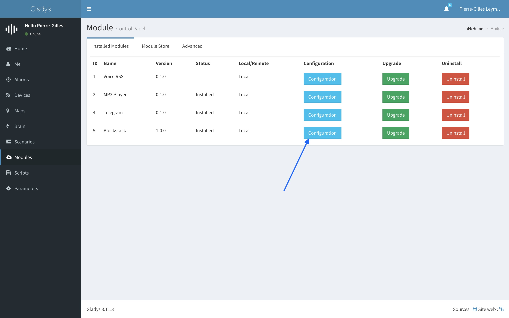

# Gladys BlockStack

Gladys is an open-source home automation assistant, that runs on your Raspberry Pi.

The Gladys-BlockStack module allows you to save your home preferences in the BlockStack network.

It means that you can safely rely on Blockstack to store your home preferences, because data is end-to-end encrypted on BlockStack.

Read more about their technology on their website => [https://blockstack.org/](https://blockstack.org/).

## Installation

To install this module, go to your Gladys, go to the module tabs, click on `Advanced`, then enter the following informations:

- Name: `BlockStack`
- Version: `1.0.0`
- Git URL: `https://github.com/GladysProject/gladys-blockstack`
- Slug: `blockstack`

Click on `install`, then reboot Gladys!

## Usage

- Go to the`Modules` tab in Gladys, then click on the `Configuration` button of the BlockStack module. 

- You can now login with your BlockStack account

- You should be able to login, save your home preferences in Blockstack and re-import it back when needed.

